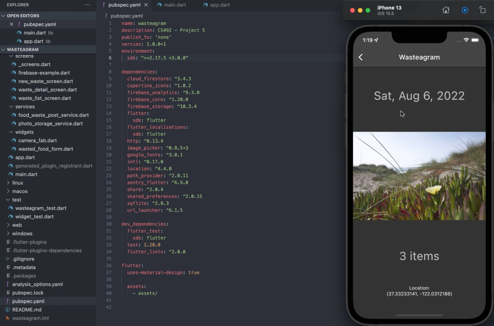

# Wasteagram

A mobile app built for CS 492 - Mobile Software Development. The app enables coffee shop employees to document daily food waste in the form of "posts" consisting of a photo, number of leftover items, the current date, and the location of the device when the post is created. The application also displays a list of all previous posts. 

Tech Stack:
Flutter, Dart, Firebase Database, and Firestore (cloud storage).

